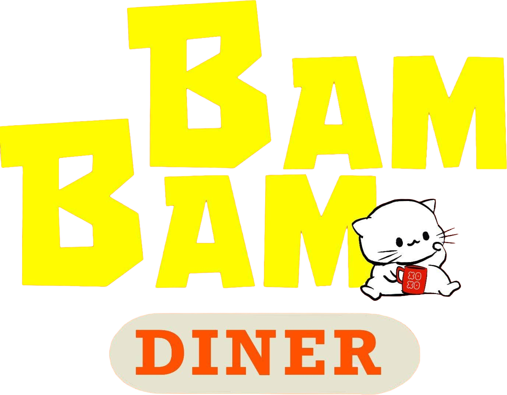

# Bambam Diner

**A bold, scroll-led restaurant website for Bambam Diner, a ramen house in San Marcelino, Zambales.**

This portfolio project turns the anticipation of a bowl of ramen into the opening interaction: as visitors scroll, a low-poly bowl fills with broth, noodles, toppings, and steam. The rest of the site makes it easy to explore the menu, get directions, and call or message the diner.

<p align="center">
  
</p>

## What I built

- A cinematic, scroll-driven hero with an interactive 3D ramen bowl
- A lightweight SVG bowl fallback for browsers without WebGL
- Responsive menu, gallery, visit, About, and FAQ pages
- A branded loading curtain, Japanese-diner visual language, and custom mascot treatment
- An opt-in music player with shuffle, repeat, volume controls, and per-tab playback continuity
- Motion that respects `prefers-reduced-motion` and pauses work when it is off-screen
- Direct call, Messenger, Facebook, and Google Maps paths for visitors ready to visit or order

## Built with

- Semantic HTML
- Vanilla CSS and JavaScript
- [Three.js](https://threejs.org/) for the 3D ramen bowl
- Google Fonts plus a self-hosted display font
- Vercel clean URLs for `/about` and `/faq`

## Run locally

This is a static site. From the project root, serve it with any local web server:

```powershell
py -m http.server 8000
```

Then open `http://localhost:8000`.

## Project note

This repository is a portfolio website build. Brand assets and business details belong to Bambam Diner; the project is shared here to showcase web design, frontend craft, animation, and progressive enhancement.
